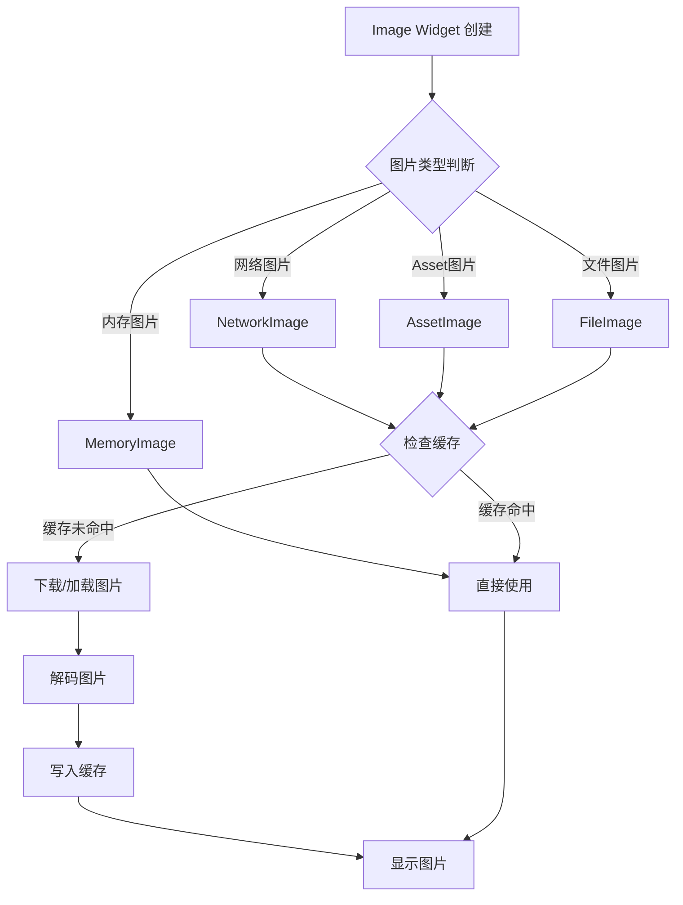
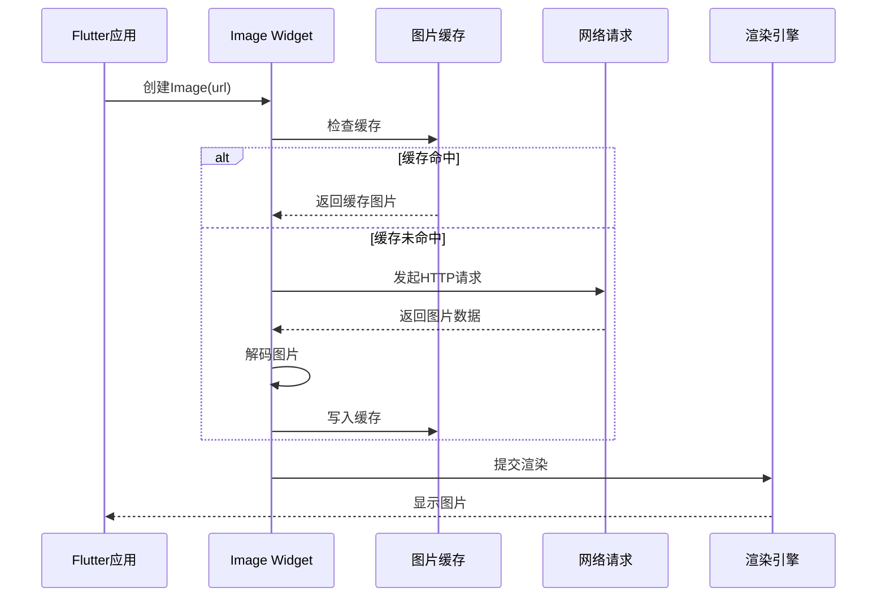
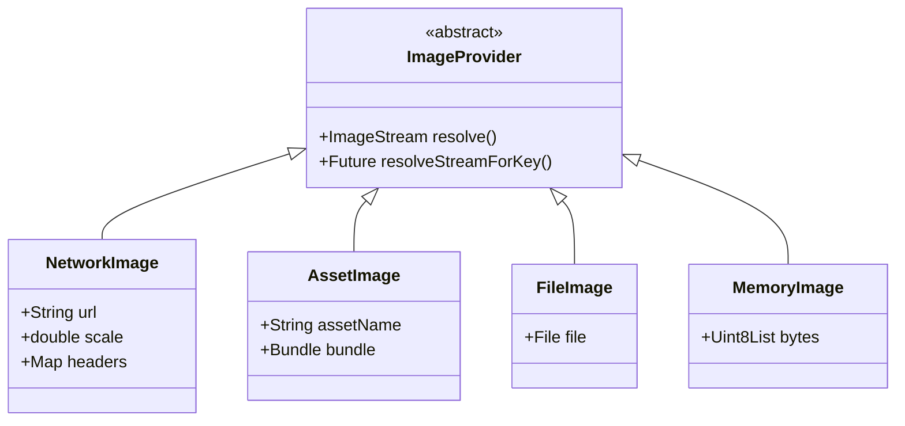
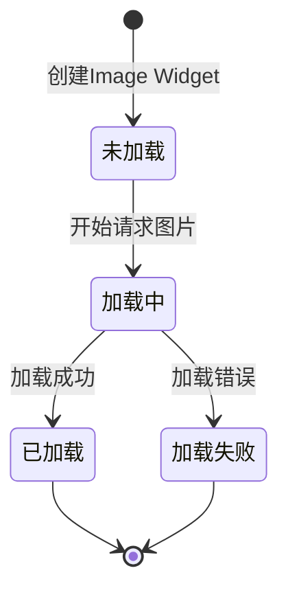

# Flutter 框架跨平台鸿蒙开发 —— Image Widget 基础：图片加载方式

> **💡 对应示例应用**：`flutter_examples/image_widget_demo` - Image Widget 图片加载演示

### 🚀 快速运行

```bash
# 进入 Image Widget 演示项目
cd flutter_examples/image_widget_demo

# 运行应用
flutter run

# 或指定鸿蒙虚拟机
flutter run -d 127.0.0.1:5555
```

**演示内容**：
- 🖼️ 网络图片加载
- 📦 Asset 图片加载
- 🖥️ 本地文件图片加载
- 📷 实际应用场景：图片卡片、头像展示

---

## 一、 前言

在 Flutter 跨平台鸿蒙开发中，Image Widget 是用于显示图片的核心组件。相比 Text Widget，Image 的使用看似简单，但涉及图片加载、缓存、内存管理等复杂机制。掌握 Image Widget 的基础使用，是打造优秀视觉体验的第一步。

本文将从 Image Widget 的核心概念出发，通过实际应用场景的示例，带你深入理解图片的加载方式和原理。

---

## 二、 图片加载方式流程图

### 2.1 Image Widget 整体加载流程



### 2.2 网络图片加载详细流程



---

## 三、 Image Widget 核心属性对比表

| 属性 | 类型 | 作用 | 鸿蒙适配建议 | 常用值 |
|------|------|------|--------------|--------|
| `image` | ImageProvider | 图片数据源 | 根据场景选择合适的Provider | NetworkImage, AssetImage |
| `width` | double? | 图片宽度 | 根据UI设计设置 | null（自适应） |
| `height` | double? | 图片高度 | 根据UI设计设置 | null（自适应） |
| `fit` | BoxFit? | 图片适应方式 | 保持图片比例 | BoxFit.cover, BoxFit.contain |
| `alignment` | AlignmentGeometry? | 对齐方式 | 鸿蒙默认居中 | Alignment.center |
| `color` | Color? | 混合颜色 | 用于图标着色 | null |
| `colorBlendMode` | BlendMode? | 混合模式 | 配合color使用 | BlendMode.srcIn |
| `repeat` | ImageRepeat? | 重复方式 | 平铺场景 | ImageRepeat.noRepeat |

---

## 四、 图片加载方式详解

### 4.1 ImageProvider 架构



### 4.2 三种主要加载方式

#### 方式1：网络图片加载
```dart
Image.network(
  'https://example.com/image.jpg',
  width: 200,
  height: 200,
  fit: BoxFit.cover,
)
```

#### 方式2：Asset图片加载
```dart
// pubspec.yaml中配置
// assets:
//   - assets/images/

Image.asset(
  'assets/images/logo.png',
  width: 100,
  height: 100,
)
```

#### 方式3：文件图片加载
```dart
Image.file(
  File('/path/to/local/image.jpg'),
  width: 200,
  height: 200,
)
```

---

## 五、 实战：图片卡片应用

下面是一个完整的可运行示例，展示 Image Widget 的实际应用：

### 5.1 完整代码示例

```dart
import 'package:flutter/material.dart';

void main() => runApp(const ImageDemoApp());

/// Image Widget 演示应用
class ImageDemoApp extends StatelessWidget {
  const ImageDemoApp({Key? key}) : super(key: key);

  @override
  Widget build(BuildContext context) {
    return MaterialApp(
      debugShowCheckedModeBanner: false,
      title: 'Image Widget 演示',
      theme: ThemeData(
        primarySwatch: Colors.blue,
        useMaterial3: true,
      ),
      home: const HomePage(),
    );
  }
}

/// 主页面
class HomePage extends StatelessWidget {
  const HomePage({Key? key}) : super(key: key);

  @override
  Widget build(BuildContext context) {
    return Scaffold(
      backgroundColor: Colors.grey[50],
      appBar: AppBar(
        title: const Text(
          'Image Widget 演示',
          style: TextStyle(
            fontSize: 20,
            fontWeight: FontWeight.bold,
            color: Colors.white,
          ),
        ),
        centerTitle: true,
        elevation: 0,
        backgroundColor: Colors.blue[600],
      ),
      body: const SingleChildScrollView(
        padding: EdgeInsets.all(16),
        child: Column(
          children: [
            NetworkImageCard(),
            SizedBox(height: 20),
            AssetImageCard(),
            SizedBox(height: 20),
            UserProfileCard(),
          ],
        ),
      ),
    );
  }
}

/// 网络图片卡片
class NetworkImageCard extends StatelessWidget {
  const NetworkImageCard({Key? key}) : super(key: key);

  @override
  Widget build(BuildContext context) {
    return Container(
      decoration: BoxDecoration(
        color: Colors.white,
        borderRadius: BorderRadius.circular(16),
        boxShadow: [
          BoxShadow(
            color: Colors.black.withOpacity(0.08),
            blurRadius: 12,
            offset: const Offset(0, 4),
          ),
        ],
      ),
      child: Column(
        crossAxisAlignment: CrossAxisAlignment.start,
        children: [
          // 网络图片
          ClipRRect(
            borderRadius: const BorderRadius.vertical(top: Radius.circular(16)),
            child: Image.network(
              'https://images.unsplash.com/photo-1506905925346-21bda4d32df4?w=800',
              width: double.infinity,
              height: 200,
              fit: BoxFit.cover,
              loadingBuilder: (context, child, loadingProgress) {
                if (loadingProgress == null) return child;
                return Container(
                  width: double.infinity,
                  height: 200,
                  color: Colors.grey[200],
                  child: Center(
                    child: CircularProgressIndicator(
                      value: loadingProgress.expectedTotalBytes != null
                          ? loadingProgress.cumulativeBytesLoaded /
                              loadingProgress.expectedTotalBytes!
                          : null,
                    ),
                  ),
                );
              },
              errorBuilder: (context, error, stackTrace) {
                return Container(
                  width: double.infinity,
                  height: 200,
                  color: Colors.grey[300],
                  child: const Center(
                    child: Icon(Icons.error, color: Colors.grey, size: 48),
                  ),
                );
              },
            ),
          ),
          // 内容
          Padding(
            padding: const EdgeInsets.all(16),
            child: Column(
              crossAxisAlignment: CrossAxisAlignment.start,
              children: [
                Text(
                  '网络图片加载',
                  style: TextStyle(
                    fontSize: 18,
                    fontWeight: FontWeight.bold,
                    color: Colors.grey[800],
                  ),
                ),
                const SizedBox(height: 8),
                Text(
                  '从网络URL加载高清风景照片，展示Image.network()的强大功能。',
                  style: TextStyle(
                    fontSize: 14,
                    color: Colors.grey[600],
                    height: 1.5,
                  ),
                ),
                const SizedBox(height: 12),
                Row(
                  children: [
                    _buildTag('网络', Colors.blue),
                    const SizedBox(width: 8),
                    _buildTag('加载中', Colors.orange),
                  ],
                ),
              ],
            ),
          ),
        ],
      ),
    );
  }

  Widget _buildTag(String text, Color color) {
    return Container(
      padding: const EdgeInsets.symmetric(horizontal: 8, vertical: 4),
      decoration: BoxDecoration(
        color: color.withOpacity(0.1),
        borderRadius: BorderRadius.circular(6),
      ),
      child: Text(
        text,
        style: TextStyle(
          fontSize: 12,
          color: color,
          fontWeight: FontWeight.w500,
        ),
      ),
    );
  }
}

/// Asset图片卡片
class AssetImageCard extends StatelessWidget {
  const AssetImageCard({Key? key}) : super(key: key);

  @override
  Widget build(BuildContext context) {
    return Container(
      decoration: BoxDecoration(
        color: Colors.white,
        borderRadius: BorderRadius.circular(16),
        boxShadow: [
          BoxShadow(
            color: Colors.black.withOpacity(0.08),
            blurRadius: 12,
            offset: const Offset(0, 4),
          ),
        ],
      ),
      child: Row(
        children: [
          // Asset图片（使用占位图）
          ClipRRect(
            borderRadius: const BorderRadius.horizontal(
              left: Radius.circular(16),
            ),
            child: Container(
              width: 120,
              height: 120,
              color: Colors.blue[100],
              child: Icon(
                Icons.image,
                size: 64,
                color: Colors.blue[300],
              ),
            ),
          ),
          // 内容
          Expanded(
            child: Padding(
              padding: const EdgeInsets.all(16),
              child: Column(
                crossAxisAlignment: CrossAxisAlignment.start,
                children: [
                  Text(
                    'Asset图片加载',
                    style: TextStyle(
                      fontSize: 18,
                      fontWeight: FontWeight.bold,
                      color: Colors.grey[800],
                    ),
                  ),
                  const SizedBox(height: 8),
                  Text(
                    '从项目资源目录加载图片，适合应用内常用素材。',
                    style: TextStyle(
                      fontSize: 14,
                      color: Colors.grey[600],
                      height: 1.5,
                    ),
                    maxLines: 2,
                    overflow: TextOverflow.ellipsis,
                  ),
                  const SizedBox(height: 12),
                  Row(
                    children: [
                      _buildTag('资源', Colors.green),
                      const SizedBox(width: 8),
                      _buildTag('快速加载', Colors.purple),
                    ],
                  ),
                ],
              ),
            ),
          ),
        ],
      ),
    );
  }

  Widget _buildTag(String text, Color color) {
    return Container(
      padding: const EdgeInsets.symmetric(horizontal: 8, vertical: 4),
      decoration: BoxDecoration(
        color: color.withOpacity(0.1),
        borderRadius: BorderRadius.circular(6),
      ),
      child: Text(
        text,
        style: TextStyle(
          fontSize: 12,
          color: color,
          fontWeight: FontWeight.w500,
        ),
      ),
    );
  }
}

/// 用户资料卡片（实际应用）
class UserProfileCard extends StatelessWidget {
  const UserProfileCard({Key? key}) : super(key: key);

  @override
  Widget build(BuildContext context) {
    return Container(
      padding: const EdgeInsets.all(20),
      decoration: BoxDecoration(
        gradient: LinearGradient(
          begin: Alignment.topLeft,
          end: Alignment.bottomRight,
          colors: [
            Colors.purple[400]!,
            Colors.purple[600]!,
          ],
        ),
        borderRadius: BorderRadius.circular(20),
        boxShadow: [
          BoxShadow(
            color: Colors.purple.withOpacity(0.3),
            blurRadius: 12,
            offset: const Offset(0, 4),
          ),
        ],
      ),
      child: Column(
        children: [
          // 头像（网络图片）
          Container(
            width: 80,
            height: 80,
            decoration: BoxDecoration(
              shape: BoxShape.circle,
              border: Border.all(color: Colors.white, width: 4),
              boxShadow: [
                BoxShadow(
                  color: Colors.black.withOpacity(0.2),
                  blurRadius: 8,
                  offset: const Offset(0, 4),
                ),
              ],
            ),
            child: ClipOval(
              child: Image.network(
                'https://api.dicebear.com/7.x/avataaars/svg?seed=Felix',
                fit: BoxFit.cover,
                errorBuilder: (context, error, stackTrace) {
                  return Container(
                    color: Colors.purple[200],
                    child: const Icon(Icons.person, size: 40, color: Colors.white70),
                  );
                },
              ),
            ),
          ),
          const SizedBox(height: 16),
          Text(
            '张三',
            style: TextStyle(
              fontSize: 24,
              fontWeight: FontWeight.bold,
              color: Colors.white,
            ),
          ),
          const SizedBox(height: 4),
          Text(
            'Flutter 开发工程师',
            style: TextStyle(
              fontSize: 14,
              color: Colors.white70,
            ),
          ),
          const SizedBox(height: 20),
          Row(
            mainAxisAlignment: MainAxisAlignment.spaceEvenly,
            children: [
              _buildStat('项目', '28'),
              _buildStat('粉丝', '1.2k'),
              _buildStat('获赞', '5.6k'),
            ],
          ),
        ],
      ),
    );
  }

  Widget _buildStat(String label, String value) {
    return Column(
      children: [
        Text(
          value,
          style: TextStyle(
            fontSize: 18,
            fontWeight: FontWeight.bold,
            color: Colors.white,
          ),
        ),
        const SizedBox(height: 4),
        Text(
          label,
          style: TextStyle(
            fontSize: 12,
            color: Colors.white70,
          ),
        ),
      ],
    );
  }
}
```

### 5.2 关键知识点说明

#### 1. 图片加载状态处理


```dart
Image.network(
  url,
  loadingBuilder: (context, child, loadingProgress) {
    // 处理加载中状态
    if (loadingProgress == null) return child;
    return CircularProgressIndicator();
  },
  errorBuilder: (context, error, stackTrace) {
    // 处理加载失败状态
    return Icon(Icons.error);
  },
)
```

#### 2. BoxFit 图片适应方式对比

| BoxFit | 效果 | 适用场景 |
|--------|------|----------|
| `fill` | 填充容器，可能变形 | 需要完全填充的场景 |
| `cover` | 裁剪填充，保持比例 | 背景图、封面图 |
| `contain` | 完整显示，保持比例 | 商品详情图、头像 |
| `fitWidth` | 宽度填充 | 横向滚动图片列表 |
| `fitHeight` | 高度填充 | 纵向滚动图片列表 |
| `none` | 原始尺寸 | 需要原图的场景 |
| `scaleDown` | 缩小至包含 | 响应式图片 |

```dart
// BoxFit.cover示例（推荐用于封面图）
Image.network(
  url,
  fit: BoxFit.cover,  // 裁剪填充，保持比例
)
```

---

## 六、 最佳实践

### 6.1 图片加载建议

| 场景 | 推荐方式 | 原因 |
|------|----------|------|
| 应用Logo、图标 | Asset | 打包进应用，快速加载 |
| 用户头像 | Network | 动态内容，需要更新 |
| 临时图片 | Memory | 内存缓存，快速访问 |
| 相册图片 | File | 本地文件，权限可控 |

### 6.2 性能优化技巧

1. **使用缓存**
   ```dart
   // Flutter默认启用图片缓存
   // 可自定义缓存策略
   Image.network(
     url,
     cacheWidth: 400,  // 限制缓存尺寸
     cacheHeight: 400,
   )
   ```

2. **预加载图片**
   ```dart
   // 预加载图片，提前进入缓存
   precacheImage(NetwordImage(url), context);
   ```

3. **合理使用BoxFit**
   ```dart
   // 封面图使用cover
   // 详情图使用contain
   // 背景图使用fill
   ```

### 6.3 避免的坑点

| 坑点 | 解决方案 |
|------|----------|
| 图片变形 | 使用BoxFit.cover或contain |
| 内存溢出 | 限制cacheWidth和cacheHeight |
| 加载慢 | 添加loadingBuilder |
| 错误无提示 | 添加errorBuilder |
| 图片模糊 | 使用高分辨率源图 |

---

## 七、 总结

Image Widget 是 Flutter UI 开发中不可或缺的组件。掌握 Image 的使用技巧，需要理解：

1. **选择合适的加载方式**: 网络、Asset、文件各有适用场景
2. **处理加载状态**: loadingBuilder和errorBuilder提升用户体验
3. **理解BoxFit**: 选择正确的图片适应方式
4. **性能优化**: 合理使用缓存和预加载
5. **错误处理**: 做好异常处理，避免应用崩溃

记住，**好的图片设计不仅仅是显示图片，而是恰到好处的加载、展示和管理**。当你能够熟练运用 Image Widget 时，你就已经在通往高级工程师的道路上迈出了坚实的一步。

---

**下一篇预告**: Image Widget 图片处理：圆角、裁剪、阴影

---

## 附录

### A. pubspec.yaml配置

```yaml
# 添加Asset图片资源
flutter:
  assets:
    - assets/images/
    - assets/icons/
```

### B. 常用网络图片API

- **Unsplash**: https://source.unsplash.com/random
- **Lorem Picsum**: https://picsum.photos/800/600
- **DiceBear Avatars**: https://api.dicebear.com/7.x/avataaars/svg

### C. 图片调试技巧

```dart
// 开启图片缓存调试
MaterialApp(
  debugShowMaterialGrid: false,
  checkerboardRasterCacheImages: true,  // 显示图片缓存
  checkerboardOffscreenLayers: true,    // 显示离屏图层
)
```

---

**欢迎加入开源鸿蒙跨平台社区**: https://openharmonycrossplatform.csdn.net
