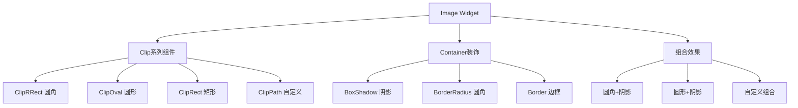
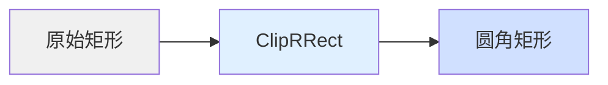
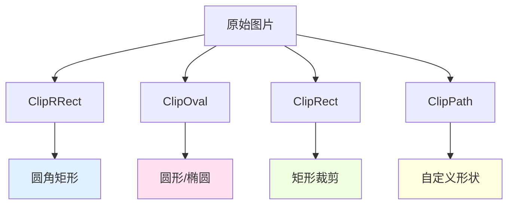
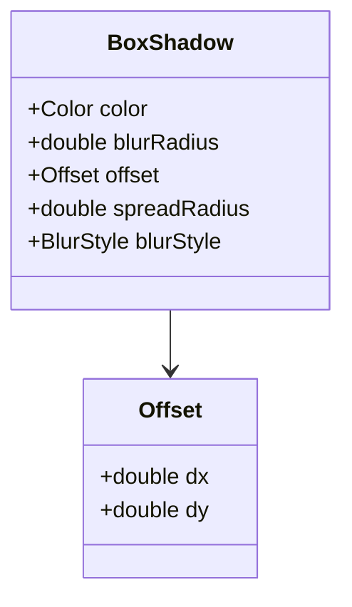

# Flutter 框架跨平台鸿蒙开发 —— Image Widget 图片处理：圆角、裁剪、阴影

## 🚀 快速运行

### 示例应用
本篇文章的示例项目：`flutter_examples/image_radius_demo`

### 运行步骤

```bash
# 进入示例项目目录
cd flutter_examples/image_radius_demo

# 运行应用（鸿蒙虚拟机）
flutter run -d 127.0.0.1:5555

# 或运行应用（其他设备）
flutter run
```

### 演示内容

运行应用后，您将看到以下7个演示组件：

1. **🖼️ 圆角图片效果** - 展示不同圆角大小的图片
2. **✂️ 图片裁剪效果** - 展示圆形、矩形、自定义裁剪
3. **🌟 图片阴影效果** - 展示轻微、深度、彩色、发光阴影
4. **🎭 组合效果展示** - 展示圆角+阴影、圆形+阴影组合
5. **📱 实际应用：产品卡片** - 电商产品展示
6. **👥 实际应用：用户列表** - 社交用户列表
7. **🏠 实际应用：房产展示** - 房产信息卡片

每个组件都包含完整的代码实现，可以直接查看和学习。

---

## 一、 前言

在上一篇《Image Widget 基础：图片加载方式》中，我们学习了如何加载不同来源的图片。然而，在实际应用中，仅仅显示图片是远远不够的。现代 UI 设计要求图片具有各种视觉效果：圆角、阴影、裁剪等。

本篇文章将深入探讨 Flutter 中 Image Widget 的高级图片处理技术，包括：
- 使用 ClipRRect 实现圆角效果
- 使用 ClipOval、ClipPath 实现各种裁剪效果
- 使用 BoxShadow 添加阴影效果
- 组合多种效果创建精美的 UI 组件

这些技术不仅适用于图片，也适用于其他 Widget，是 Flutter UI 开发中的重要技能。

---

## 二、 图片处理技术架构

### 2.1 图片处理技术体系



### 2.2 核心组件对比

| 组件 | 主要用途 | 优势 | 适用场景 |
|------|----------|------|----------|
| `ClipRRect` | 圆角裁剪 | 灵活控制圆角 | 卡片、按钮图片 |
| `ClipOval` | 圆形裁剪 | 简单直接 | 头像、圆形图标 |
| `ClipRect` | 矩形裁剪 | 性能最优 | 简单裁剪场景 |
| `ClipPath` | 自定义裁剪 | 无限可能 | 特殊形状、创意设计 |
| `BoxShadow` | 阴影效果 | 逼真立体 | 卡片、悬浮按钮 |

---

## 三、 圆角图片处理

### 3.1 ClipRRect 原理

ClipRRect（Clipped Rounded Rectangle）是 Flutter 中实现圆角效果的核心组件。它通过裁剪子组件的矩形区域，使其四个角呈现圆弧状。



### 3.2 基础用法

```dart
ClipRRect(
  borderRadius: BorderRadius.circular(16),  // 圆角半径
  child: Image.asset('assets/image.jpg'),
)
```

### 3.3 BorderRadius 详解

```mermaid
classDiagram
    class BorderRadius {
        +BorderRadius.circular(double radius)
        +BorderRadius.only({
          topLeft, topRight,
          bottomLeft, bottomRight
        })
        +BorderRadius.all(Radius radius)
        +BorderRadius.vertical({
          top, bottom
        })
        +BorderRadius.horizontal({
          left, right
        })
    }

    class Radius {
        +Radius.circular(double radius)
        +Radius.elliptical(double x, double y)
    }

    BorderRadius --> Radius
```

#### 3.3.1 不同圆角效果对比

| 方法 | 效果 | 代码示例 |
|------|------|----------|
| `circular(16)` | 四角相同圆角 | `BorderRadius.circular(16)` |
| `only(topLeft: 16)` | 仅左上角圆角 | `BorderRadius.only(topLeft: Radius.circular(16))` |
| `vertical(top: 16)` | 上下圆角 | `BorderRadius.vertical(top: Radius.circular(16))` |
| `horizontal(left: 16)` | 左右圆角 | `BorderRadius.horizontal(left: Radius.circular(16))` |

#### 3.3.2 实际代码示例

```dart
// 四角相同圆角
ClipRRect(
  borderRadius: BorderRadius.circular(16),
  child: Image.asset('assets/image.jpg'),
)

// 仅顶部圆角
ClipRRect(
  borderRadius: const BorderRadius.vertical(
    top: Radius.circular(16),
  ),
  child: Image.asset('assets/image.jpg'),
)

// 自定义每个角的圆角
ClipRRect(
  borderRadius: BorderRadius.only(
    topLeft: Radius.circular(20),
    topRight: Radius.circular(10),
    bottomLeft: Radius.circular(10),
    bottomRight: Radius.circular(20),
  ),
  child: Image.asset('assets/image.jpg'),
)
```

---

## 四、 图片裁剪技术

### 4.1 ClipOval 圆形裁剪

ClipOval 将子组件裁剪为椭圆形或圆形（当宽高相等时）。

```dart
// 圆形裁剪（头像）
ClipOval(
  child: Image.network(
    'https://api.dicebear.com/7.x/avataaars/svg?seed=John',
    width: 100,
    height: 100,
    fit: BoxFit.cover,
  ),
)

// 椭圆形裁剪
ClipOval(
  child: Image.network(
    'https://example.com/image.jpg',
    width: 200,
    height: 100,
    fit: BoxFit.cover,
  ),
)
```

### 4.2 ClipRect 矩形裁剪

ClipRect 将子组件裁剪为矩形，通常用于裁剪溢出内容。

```dart
ClipRect(
  child: Align(
    alignment: Alignment.center,
    heightFactor: 0.5,  // 只显示上半部分
    child: Image.asset('assets/image.jpg'),
  ),
)
```

### 4.3 ClipPath 自定义裁剪

ClipPath 允许使用自定义路径进行裁剪，实现任意形状。

#### 4.3.1 自定义 Clipper

```dart
class StarClipper extends CustomClipper<Path> {
  @override
  Path getClip(Size size) {
    final path = Path();
    final center = Offset(size.width / 2, size.height / 2);
    final radius = size.width / 2;
    final points = 5;
    final innerRadius = radius * 0.5;

    for (int i = 0; i < points * 2; i++) {
      final angle = (i * 3.1415926) / points - 3.1415926 / 2;
      final r = i % 2 == 0 ? radius : innerRadius;
      final x = center.dx + r * cos(angle);
      final y = center.dy + r * sin(angle);

      if (i == 0) {
        path.moveTo(x, y);
      } else {
        path.lineTo(x, y);
      }
    }

    path.close();
    return path;
  }

  @override
  bool shouldReclip(CustomClipper<Path> oldClipper) => false;
}
```

#### 4.3.2 使用自定义 Clipper

```dart
ClipPath(
  clipper: StarClipper(),
  child: Image.asset('assets/image.jpg'),
)
```

### 4.4 裁剪效果对比



---

## 五、 图片阴影效果

### 5.1 BoxShadow 核心属性



### 5.2 BoxShadow 属性详解

| 属性 | 类型 | 作用 | 常用值 |
|------|------|------|--------|
| `color` | Color | 阴影颜色 | `Colors.black.withOpacity(0.2)` |
| `blurRadius` | double | 模糊半径 | `8`, `16`, `24` |
| `offset` | Offset | 阴影偏移 | `Offset(0, 4)` |
| `spreadRadius` | double | 扩散半径 | `0`, `2`, `4` |
| `blurStyle` | BlurStyle | 模糊样式 | `BlurStyle.normal` |

### 5.3 不同阴影效果

#### 5.3.1 轻微阴影

```dart
BoxShadow(
  color: Colors.black.withOpacity(0.1),
  blurRadius: 8,
  offset: const Offset(0, 2),
)
```

#### 5.3.2 深度阴影

```dart
BoxShadow(
  color: Colors.black.withOpacity(0.3),
  blurRadius: 20,
  offset: const Offset(0, 10),
)
```

#### 5.3.3 彩色阴影

```dart
BoxShadow(
  color: Colors.blue.withOpacity(0.5),
  blurRadius: 15,
  offset: const Offset(0, 8),
)
```

#### 5.3.4 发光效果

```dart
BoxShadow(
  color: Colors.amber.withOpacity(0.6),
  blurRadius: 30,
  offset: const Offset(0, 0),
  spreadRadius: 5,
)
```

### 5.4 多层阴影叠加

```dart
Container(
  decoration: BoxDecoration(
    boxShadow: [
      // 第一层：轻微阴影
      BoxShadow(
        color: Colors.black.withOpacity(0.1),
        blurRadius: 8,
        offset: const Offset(0, 2),
      ),
      // 第二层：彩色阴影
      BoxShadow(
        color: Colors.blue.withOpacity(0.3),
        blurRadius: 16,
        offset: const Offset(0, 8),
      ),
    ],
  ),
  child: Image.asset('assets/image.jpg'),
)
```

---

## 六、 组合效果实战

### 6.1 圆角 + 阴影

```dart
Container(
  decoration: BoxDecoration(
    borderRadius: BorderRadius.circular(16),
    boxShadow: [
      BoxShadow(
        color: Colors.black.withOpacity(0.2),
        blurRadius: 12,
        offset: const Offset(0, 4),
      ),
    ],
  ),
  child: ClipRRect(
    borderRadius: BorderRadius.circular(16),
    child: Image.asset('assets/image.jpg'),
  ),
)
```

### 6.2 圆形 + 阴影（头像）

```dart
Container(
  decoration: BoxDecoration(
    shape: BoxShape.circle,
    boxShadow: [
      BoxShadow(
        color: Colors.black.withOpacity(0.2),
        blurRadius: 8,
        offset: const Offset(0, 4),
      ),
    ],
  ),
  child: ClipOval(
    child: Image.asset('assets/avatar.jpg'),
  ),
)
```

### 6.3 实际应用：产品卡片

```dart
Container(
  decoration: BoxDecoration(
    color: Colors.white,
    borderRadius: BorderRadius.circular(16),
    boxShadow: [
      BoxShadow(
        color: Colors.black.withOpacity(0.15),
        blurRadius: 16,
        offset: const Offset(0, 8),
      ),
    ],
  ),
  child: Column(
    crossAxisAlignment: CrossAxisAlignment.start,
    children: [
      ClipRRect(
        borderRadius: const BorderRadius.vertical(
          top: Radius.circular(16),
        ),
        child: Image.network(
          product.imageUrl,
          width: double.infinity,
          height: 200,
          fit: BoxFit.cover,
        ),
      ),
      Padding(
        padding: const EdgeInsets.all(16),
        child: Column(
          crossAxisAlignment: CrossAxisAlignment.start,
          children: [
            Text(
              product.name,
              style: const TextStyle(
                fontSize: 18,
                fontWeight: FontWeight.bold,
              ),
            ),
            const SizedBox(height: 8),
            Text(
              product.description,
              style: TextStyle(
                fontSize: 14,
                color: Colors.grey[600],
              ),
            ),
            const SizedBox(height: 16),
            Text(
              '¥${product.price}',
              style: TextStyle(
                fontSize: 24,
                fontWeight: FontWeight.bold,
                color: Colors.red[600],
              ),
            ),
          ],
        ),
      ),
    ],
  ),
)
```

---

## 七、 最佳实践

### 7.1 性能优化

| 优化点 | 说明 | 实现 |
|--------|------|------|
| **避免过度裁剪** | 裁剪操作消耗性能 | 合理选择裁剪方式 |
| **使用 RepaintBoundary** | 隔离重绘区域 | 在复杂组件外包裹 |
| **缓存图片** | 减少重复加载 | 使用 `cacheWidth` 和 `cacheHeight` |
| **减少阴影层数** | 多层阴影影响性能 | 控制在2-3层以内 |

```dart
// 使用 RepaintBoundary 优化
RepaintBoundary(
  child: Container(
    decoration: BoxDecoration(
      borderRadius: BorderRadius.circular(16),
      boxShadow: [
        BoxShadow(
          color: Colors.black.withOpacity(0.2),
          blurRadius: 12,
          offset: const Offset(0, 4),
        ),
      ],
    ),
    child: ClipRRect(
      borderRadius: BorderRadius.circular(16),
      child: Image.asset('assets/image.jpg'),
    ),
  ),
)
```

### 7.2 鸿蒙平台适配

```dart
// 鸿蒙平台特殊处理
import 'dart:io';

Widget build(BuildContext context) {
  final isHarmonyOS = Platform.isAndroid;

  return Container(
    decoration: BoxDecoration(
      borderRadius: BorderRadius.circular(16),
      // 鸿蒙平台可能需要调整阴影
      boxShadow: isHarmonyOS
          ? [
              BoxShadow(
                color: Colors.black.withOpacity(0.15),
                blurRadius: 10,
                offset: const Offset(0, 3),
              ),
            ]
          : [
              BoxShadow(
                color: Colors.black.withOpacity(0.2),
                blurRadius: 12,
                offset: const Offset(0, 4),
              ),
            ],
    ),
    child: ClipRRect(
      borderRadius: BorderRadius.circular(16),
      child: Image.asset('assets/image.jpg'),
    ),
  );
}
```

### 7.3 常见问题解决

| 问题 | 原因 | 解决方案 |
|------|------|----------|
| 阴影显示不完整 | 裁剪范围不足 | 增加容器 padding |
| 圆角有锯齿 | 抗锯齿不足 | 增加图片分辨率 |
| 性能下降 | 过多阴影和裁剪 | 使用 RepaintBoundary |
| 阴影颜色不对 | 透明度设置错误 | 调整 `color.withOpacity()` |

---

## 八、 总结

Image Widget 的图片处理技术是 Flutter UI 开发中的重要技能。掌握这些技术，你将能够：

1. **圆角效果**：使用 ClipRRect 灵活控制圆角
2. **裁剪技术**：使用 ClipOval、ClipPath 实现各种形状
3. **阴影效果**：使用 BoxShadow 创建立体感
4. **组合效果**：将多种技术组合使用，创建精美 UI
5. **性能优化**：合理使用 RepaintBoundary 等技术

记住，**好的 UI 设计不仅仅是显示图片，而是通过适当的视觉效果提升用户体验**。当你能够熟练运用这些图片处理技术时，你就已经掌握了 Flutter UI 开发的重要一环。

---

## 二、 参考资源

- [Flutter 官方文档 - ClipRRect](https://api.flutter.dev/flutter/widgets/ClipRRect-class.html)
- [Flutter 官方文档 - ClipOval](https://api.flutter.dev/flutter/widgets/ClipOval-class.html)
- [Flutter 官方文档 - BoxShadow](https://api.flutter.dev/flutter/painting/BoxShadow-class.html)
- [Flutter 官方文档 - CustomClipper](https://api.flutter.dev/flutter/rendering/CustomClipper-class.html)

---

**下一篇预告**: 图片状态处理：占位符与错误处理
