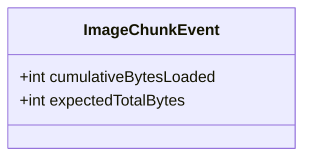
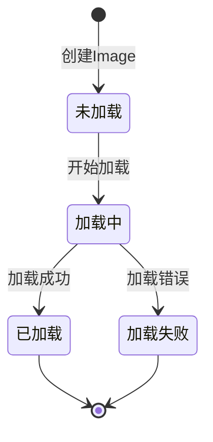

# Flutter 框架跨平台鸿蒙开发 —— Image Widget 状态处理：加载中与错误处理

## 示例代码

```dart
import 'package:flutter/material.dart';

void main() => runApp(const ImageStateHandlingApp());

class ImageStateHandlingApp extends StatelessWidget {
  const ImageStateHandlingApp({Key? key}) : super(key: key);

  @override
  Widget build(BuildContext context) {
    return MaterialApp(
      debugShowCheckedModeBanner: false,
      home: Scaffold(
        appBar: AppBar(title: const Text('Image Widget 状态处理')),
        body: const SingleChildScrollView(
          padding: EdgeInsets.all(16),
          child: Column(
            crossAxisAlignment: CrossAxisAlignment.start,
            children: [
              LoadingBuilderExample(),
              SizedBox(height: 20),
              ErrorBuilderExample(),
              SizedBox(height: 20),
              CompleteStateExample(),
            ],
          ),
        ),
      ),
    );
  }
}

class LoadingBuilderExample extends StatelessWidget {
  const LoadingBuilderExample({Key? key}) : super(key: key);

  @override
  Widget build(BuildContext context) {
    return Card(
      child: Column(
        crossAxisAlignment: CrossAxisAlignment.start,
        children: [
          Padding(
            padding: const EdgeInsets.all(12),
            child: Text(
              '示例1：loadingBuilder - 显示加载进度',
              style: TextStyle(fontWeight: FontWeight.bold, fontSize: 16),
            ),
          ),
          Center(
            child: Image.network(
              'https://images.unsplash.com/photo-1506905925346-21bda4d32df4?w=400',
              width: 300,
              height: 200,
              fit: BoxFit.cover,
              loadingBuilder: (context, child, loadingProgress) {
                if (loadingProgress == null) return child;
                return SizedBox(
                  width: 300,
                  height: 200,
                  child: Center(
                    child: CircularProgressIndicator(
                      value: loadingProgress.expectedTotalBytes != null
                          ? loadingProgress.cumulativeBytesLoaded / loadingProgress.expectedTotalBytes!
                          : null,
                    ),
                  ),
                );
              },
            ),
          ),
          const SizedBox(height: 12),
        ],
      ),
    );
  }
}

class ErrorBuilderExample extends StatelessWidget {
  const ErrorBuilderExample({Key? key}) : super(key: key);

  @override
  Widget build(BuildContext context) {
    return Card(
      child: Column(
        crossAxisAlignment: CrossAxisAlignment.start,
        children: [
          Padding(
            padding: const EdgeInsets.all(12),
            child: Text(
              '示例2：errorBuilder - 处理加载失败',
              style: TextStyle(fontWeight: FontWeight.bold, fontSize: 16),
            ),
          ),
          Center(
            child: Image.network(
              'https://invalid-url-that-will-fail.com/image.jpg',
              width: 300,
              height: 200,
              fit: BoxFit.cover,
              errorBuilder: (context, error, stackTrace) {
                return Container(
                  width: 300,
                  height: 200,
                  color: Colors.red[50],
                  child: const Center(
                    child: Column(
                      mainAxisAlignment: MainAxisAlignment.center,
                      children: [
                        Icon(Icons.error_outline, color: Colors.red, size: 48),
                        SizedBox(height: 8),
                        Text('图片加载失败', style: TextStyle(color: Colors.red)),
                      ],
                    ),
                  ),
                );
              },
            ),
          ),
          const SizedBox(height: 12),
        ],
      ),
    );
  }
}

class CompleteStateExample extends StatelessWidget {
  const CompleteStateExample({Key? key}) : super(key: key);

  @override
  Widget build(BuildContext context) {
    return Card(
      child: Column(
        crossAxisAlignment: CrossAxisAlignment.start,
        children: [
          Padding(
            padding: const EdgeInsets.all(12),
            child: Text(
              '示例3：完整状态处理 - 同时处理加载和错误',
              style: TextStyle(fontWeight: FontWeight.bold, fontSize: 16),
            ),
          ),
          Center(
            child: Image.network(
              'https://images.unsplash.com/photo-1505740420928-5e560c06d30e?w=400',
              width: 300,
              height: 200,
              fit: BoxFit.cover,
              loadingBuilder: (context, child, loadingProgress) {
                if (loadingProgress == null) return child;
                return SizedBox(
                  width: 300,
                  height: 200,
                  child: Center(child: CircularProgressIndicator()),
                );
              },
              errorBuilder: (context, error, stackTrace) {
                return Container(
                  width: 300,
                  height: 200,
                  color: Colors.red[50],
                  child: const Center(
                    child: Icon(Icons.error_outline, color: Colors.red, size: 48),
                  ),
                );
              },
            ),
          ),
          const SizedBox(height: 12),
        ],
      ),
    );
  }
}
```

---

## 🚀 快速运行

### 示例应用
本篇文章的示例项目：`flutter_examples/04_image_state_demo`

### 运行步骤

```bash
# 进入示例项目目录
cd flutter_examples/04_image_state_demo

# 运行应用（鸿蒙虚拟机）
flutter run -d 127.0.0.1:5555

# 或运行应用（其他设备）
flutter run
```

### 演示内容

运行应用后，您将看到本篇文章的示例：
- **示例1：加载中状态** - 使用 loadingBuilder 显示图片加载进度
- **示例2：错误处理** - 使用 errorBuilder 处理加载失败
- **示例3：完整状态** - 同时处理加载和错误状态

---

## 一、 前言

在网络请求图片时，加载需要时间，也可能会失败。如果不给用户任何反馈，体验会很差。Flutter 的 Image Widget 提供了 `loadingBuilder` 和 `errorBuilder` 两个属性，可以让我们优雅地处理这两种状态。

本篇文章讲解如何处理图片的加载中和错误状态。

---

## 二、 loadingBuilder：处理加载中状态

### 2.1 什么是 loadingBuilder

`loadingBuilder` 是 Image Widget 的一个回调属性，在图片加载过程中被调用。

```dart
Image.network(
  imageUrl,
  loadingBuilder: (context, child, loadingProgress) {
    // 返回加载中的 Widget
  },
)
```

### 2.2 参数说明

| 参数 | 类型 | 说明 |
|------|------|------|
| `context` | BuildContext | 上下文对象 |
| `child` | Widget | 加载完成后的图片 Widget |
| `loadingProgress` | ImageChunkEvent? | 加载进度信息 |

### 2.3 loadingProgress 字段



| 字段 | 类型 | 说明 |
|------|------|------|
| `cumulativeBytesLoaded` | int | 已加载的字节数 |
| `expectedTotalBytes` | int | 预期的总字节数（可能为 null） |

### 2.4 示例：显示加载进度

```dart
Image.network(
  'https://images.unsplash.com/photo-1506905925346-21bda4d32df4?w=400',
  width: 300,
  height: 300,
  fit: BoxFit.cover,
  loadingBuilder: (context, child, loadingProgress) {
    // 加载完成，显示图片
    if (loadingProgress == null) return child;

    // 加载中，显示进度条
    return SizedBox(
      width: 300,
      height: 300,
      child: Center(
        child: CircularProgressIndicator(
          value: loadingProgress.expectedTotalBytes != null
              ? loadingProgress.cumulativeBytesLoaded / loadingProgress.expectedTotalBytes!
              : null,
        ),
      ),
    );
  },
)
```

---

## 三、 errorBuilder：处理错误状态

### 3.1 什么是 errorBuilder

`errorBuilder` 是 Image Widget 的一个回调属性，在图片加载失败时被调用。

```dart
Image.network(
  imageUrl,
  errorBuilder: (context, error, stackTrace) {
    // 返回错误提示 Widget
  },
)
```

### 3.2 参数说明

| 参数 | 类型 | 说明 |
|------|------|------|
| `context` | BuildContext | 上下文对象 |
| `error` | Object? | 错误对象 |
| `stackTrace` | StackTrace? | 堆栈跟踪 |

### 3.3 示例：显示错误提示

```dart
Image.network(
  'https://invalid-url-that-will-fail.com/image.jpg',
  width: 300,
  height: 300,
  fit: BoxFit.cover,
  errorBuilder: (context, error, stackTrace) {
    return Container(
      width: 300,
      height: 300,
      color: Colors.red[50],
      child: const Center(
        child: Column(
          mainAxisAlignment: MainAxisAlignment.center,
          children: [
            Icon(Icons.error_outline, color: Colors.red, size: 48),
            SizedBox(height: 8),
            Text(
              '图片加载失败',
              style: TextStyle(color: Colors.red),
            ),
          ],
        ),
      ),
    );
  },
)
```

---

## 四、 完整状态处理：同时处理加载和错误

### 4.1 同时使用 loadingBuilder 和 errorBuilder

```dart
Image.network(
  'https://images.unsplash.com/photo-1516961642265-531546e84af2?w=400',
  width: 300,
  height: 300,
  fit: BoxFit.cover,
  loadingBuilder: (context, child, loadingProgress) {
    // 加载完成，显示图片或错误
    if (loadingProgress == null) return child;

    // 加载中，显示进度条
    return SizedBox(
      width: 300,
      height: 300,
      child: Center(
        child: CircularProgressIndicator(),
      ),
    );
  },
  errorBuilder: (context, error, stackTrace) {
    // 加载失败，显示错误提示
    return Container(
      width: 300,
      height: 300,
      color: Colors.red[50],
      child: const Center(
        child: Icon(Icons.error_outline, color: Colors.red, size: 48),
      ),
    );
  },
)
```

### 4.2 状态流转图



---

## 五、 关键要点

### 5.1 判断加载状态

```dart
if (loadingProgress == null) {
  // 加载完成或加载前
  return child;
} else {
  // 加载中
  // 显示加载动画
}
```

### 5.2 计算加载进度

```dart
// 进度 = 已加载字节数 / 总字节数
double progress = loadingProgress.cumulativeBytesLoaded / loadingProgress.expectedTotalBytes!;
```

### 5.3 常见的加载 Widget

```dart
// 1. 简单的旋转进度条
CircularProgressIndicator()

// 2. 带进度的旋转进度条
CircularProgressIndicator(
  value: 0.5,  // 0.0 到 1.0
)

// 3. 线性进度条
LinearProgressIndicator()

// 4. 自定义加载 Widget
Text('加载中...')
```

### 5.4 错误处理最佳实践

```dart
errorBuilder: (context, error, stackTrace) {
  // 1. 友好的错误提示
  // 2. 清晰的图标和文字
  // 3. 合适的颜色（通常使用红色或橙色）
  // 4. 可以提供重试按钮（在高级篇讲解）
}
```

---

## 六、 总结

loadingBuilder 和 errorBuilder 是处理图片状态的简单有效方法：

1. **参数简单**：参数清晰，易于理解和使用
2. **进度可控**：loadingBuilder 可以获取加载进度
3. **灵活性高**：可以返回任意 Widget 作为状态显示
4. **互不冲突**：两个 Builder 可以同时使用

记住，**好的用户体验从状态处理开始**。简单的 loadingBuilder 和 errorBuilder 就能显著提升应用的感知质量。

---

## 参考资源

- [Flutter 官方文档 - Image.loadingBuilder](https://api.flutter.dev/flutter/widgets/Image/loadingBuilder.html)
- [Flutter 官方文档 - Image.errorBuilder](https://api.flutter.dev/flutter/widgets/Image/errorBuilder.html)
- [Flutter 官方文档 - ImageChunkEvent](https://api.flutter.dev/flutter/painting/ImageChunkEvent-class.html)

---

## 欢迎加入开源鸿蒙跨平台社区

https://openharmonycrossplatform.csdn.net
