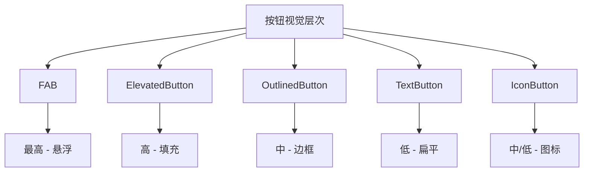

# 02-10 Flutter 框架跨平台鸿蒙开发 —— Button Widget 基础：按钮家族介绍

## 示例代码

```dart
import 'package:flutter/material.dart';

void main() => runApp(const ButtonBasicsApp());

class ButtonBasicsApp extends StatelessWidget {
  const ButtonBasicsApp({Key? key}) : super(key: key);

  @override
  Widget build(BuildContext context) {
    return MaterialApp(
      debugShowCheckedModeBanner: false,
      home: Scaffold(
        appBar: AppBar(title: const Text('Button Widget 基础')),
        body: const SingleChildScrollView(
          padding: EdgeInsets.all(16),
          child: Column(
            crossAxisAlignment: CrossAxisAlignment.start,
            children: [
              ElevatedButtonExample(),
              SizedBox(height: 20),
              TextButtonExample(),
              SizedBox(height: 20),
              OutlinedButtonExample(),
              SizedBox(height: 20),
              IconButtonExample(),
            ],
          ),
        ),
      ),
    );
  }
}

class ElevatedButtonExample extends StatelessWidget {
  const ElevatedButtonExample({Key? key}) : super(key: key);

  @override
  Widget build(BuildContext context) {
    return Card(
      child: Column(
        crossAxisAlignment: CrossAxisAlignment.start,
        children: [
          Padding(
            padding: const EdgeInsets.all(12),
            child: Text(
              '示例1：ElevatedButton - 主要操作',
              style: TextStyle(fontWeight: FontWeight.bold, fontSize: 16),
            ),
          ),
          Padding(
            padding: const EdgeInsets.all(16),
            child: Center(
              child: ElevatedButton(
                onPressed: () {},
                child: const Text('点击我'),
              ),
            ),
          ),
          const SizedBox(height: 12),
        ],
      ),
    );
  }
}

class TextButtonExample extends StatelessWidget {
  const TextButtonExample({Key? key}) : super(key: key);

  @override
  Widget build(BuildContext context) {
    return Card(
      child: Column(
        crossAxisAlignment: CrossAxisAlignment.start,
        children: [
          Padding(
            padding: const EdgeInsets.all(12),
            child: Text(
              '示例2：TextButton - 次要操作',
              style: TextStyle(fontWeight: FontWeight.bold, fontSize: 16),
            ),
          ),
          Padding(
            padding: const EdgeInsets.all(16),
            child: Center(
              child: TextButton(
                onPressed: () {},
                child: const Text('次要操作'),
              ),
            ),
          ),
          const SizedBox(height: 12),
        ],
      ),
    );
  }
}

class OutlinedButtonExample extends StatelessWidget {
  const OutlinedButtonExample({Key? key}) : super(key: key);

  @override
  Widget build(BuildContext context) {
    return Card(
      child: Column(
        crossAxisAlignment: CrossAxisAlignment.start,
        children: [
          Padding(
            padding: const EdgeInsets.all(12),
            child: Text(
              '示例3：OutlinedButton - 边框按钮',
              style: TextStyle(fontWeight: FontWeight.bold, fontSize: 16),
            ),
          ),
          Padding(
            padding: const EdgeInsets.all(16),
            child: Center(
              child: OutlinedButton(
                onPressed: () {},
                child: const Text('边框按钮'),
              ),
            ),
          ),
          const SizedBox(height: 12),
        ],
      ),
    );
  }
}

class IconButtonExample extends StatelessWidget {
  const IconButtonExample({Key? key}) : super(key: key);

  @override
  Widget build(BuildContext context) {
    return Card(
      child: Column(
        crossAxisAlignment: CrossAxisAlignment.start,
        children: [
          Padding(
            padding: const EdgeInsets.all(12),
            child: Text(
              '示例4：IconButton - 图标按钮',
              style: TextStyle(fontWeight: FontWeight.bold, fontSize: 16),
            ),
          ),
          Padding(
            padding: const EdgeInsets.all(16),
            child: Center(
              child: Row(
                mainAxisAlignment: MainAxisAlignment.center,
                children: [
                  IconButton(
                    onPressed: () {},
                    icon: const Icon(Icons.favorite),
                  ),
                  IconButton(
                    onPressed: () {},
                    icon: const Icon(Icons.share),
                  ),
                  IconButton(
                    onPressed: () {},
                    icon: const Icon(Icons.delete),
                  ),
                ],
              ),
            ),
          ),
          const SizedBox(height: 12),
        ],
      ),
    );
  }
}
```

---

## 🚀 快速运行

### 示例应用
本篇文章的示例项目：`flutter_examples/button_widget_demo_06`

### 运行步骤

```bash
# 进入示例项目目录
cd flutter_examples/button_widget_demo_06

# 运行应用（鸿蒙虚拟机）
flutter run -d 127.0.0.1:5555

# 或运行应用（其他设备）
flutter run
```

### 演示内容

运行应用后，您将看到本篇文章的示例：
- **示例1：ElevatedButton** - 主要操作按钮
- **示例2：TextButton** - 次要操作按钮
- **示例3：OutlinedButton** - 边框按钮
- **示例4：IconButton** - 图标按钮

---

## 一、 前言

Button 是 Flutter 中最重要的交互组件之一，用于触发操作和导航。Flutter 提供了多种类型的按钮，每种按钮都有其特定的使用场景。

本篇文章介绍 Flutter 按钮家族的基础成员：ElevatedButton、TextButton、OutlinedButton 和 IconButton。

---

## 二、 按钮家族成员

### 2.1 Flutter 按钮类型

| 按钮类型 | 用途 | 视觉层级 |
|----------|------|----------|
| **ElevatedButton** | 主要操作 | 高（带阴影、填充） |
| **TextButton** | 次要操作 | 低（扁平、透明） |
| **OutlinedButton** | 次要重要操作 | 中（边框、透明） |
| **IconButton** | 图标操作 | 中/低 |
| **FloatingActionButton** | 主要操作 | 最高（悬浮） |

### 2.2 按钮的视觉层次



---

## 三、 ElevatedButton

### 3.1 什么是 ElevatedButton

`ElevatedButton` 是 Material Design 3 中的标准按钮，具有阴影和填充背景，视觉层级最高，适合用于主要操作。

### 3.2 基本用法

```dart
ElevatedButton(
  onPressed: () {
    // 按钮点击事件
  },
  child: Text('确定'),
)
```

### 3.3 禁用按钮

```dart
ElevatedButton(
  onPressed: null,  // 设为 null 表示禁用
  child: Text('禁用按钮'),
)
```

### 3.4 带图标的按钮

```dart
ElevatedButton.icon(
  onPressed: () {},
  icon: Icon(Icons.save),
  label: Text('保存'),
)
```

### 3.5 使用场景

✅ **适合使用 ElevatedButton 的场景：**
- 提交表单（如"确定"、"提交"）
- 完成重要操作（如"保存"、"删除"）
- 页面级主要操作
- 引导用户完成关键步骤

❌ **不适合使用 ElevatedButton 的场景：**
- 次要操作（用 TextButton）
- 工具栏操作（用 IconButton）
- 仅信息展示（用 Text）

---

## 四、 TextButton

### 4.1 什么是 TextButton

`TextButton` 是扁平的文本按钮，没有背景色和阴影，视觉层级最低，适合用于次要操作。

### 4.2 基本用法

```dart
TextButton(
  onPressed: () {
    // 按钮点击事件
  },
  child: Text('取消'),
)
```

### 4.3 带图标的按钮

```dart
TextButton.icon(
  onPressed: () {},
  icon: Icon(Icons.close),
  label: Text('取消'),
)
```

### 4.4 使用场景

✅ **适合使用 TextButton 的场景：**
- 取消操作（如"取消"、"关闭"）
- 辅助操作（如"了解更多"、"帮助"）
- 表单次要选项
- 对话框的取消按钮

❌ **不适合使用 TextButton 的场景：**
- 主要操作（用 ElevatedButton）
- 需要强调的操作（用 OutlinedButton）

---

## 五、 OutlinedButton

### 5.1 什么是 OutlinedButton

`OutlinedButton` 是带边框的透明按钮，视觉层级介于 ElevatedButton 和 TextButton 之间，适合用于次要但重要的操作。

### 5.2 基本用法

```dart
OutlinedButton(
  onPressed: () {
    // 按钮点击事件
  },
  child: Text('编辑'),
)
```

### 5.3 带图标的按钮

```dart
OutlinedButton.icon(
  onPressed: () {},
  icon: Icon(Icons.edit),
  label: Text('编辑'),
)
```

### 5.4 使用场景

✅ **适合使用 OutlinedButton 的场景：**
- 次要但重要的操作
- 需要比 TextButton 更突出但不至于用 ElevatedButton 的场景
- 替代性选项（如"注册"旁边的"登录"）
- 可撤销的操作

❌ **不适合使用 OutlinedButton 的场景：**
- 主要操作（用 ElevatedButton）
- 极次要的操作（用 TextButton）

---

## 六、 IconButton

### 6.1 什么是 IconButton

`IconButton` 是只显示图标的按钮，适合用于工具栏、卡片操作等空间有限的场景。

### 6.2 基本用法

```dart
IconButton(
  onPressed: () {
    // 按钮点击事件
  },
  icon: Icon(Icons.favorite),
)
```

### 6.3 设置颜色和大小

```dart
IconButton(
  onPressed: () {},
  icon: Icon(Icons.favorite),
  color: Colors.red,
  iconSize: 32,
)
```

### 6.4 使用场景

✅ **适合使用 IconButton 的场景：**
- 工具栏操作（如搜索、菜单）
- 列表项操作（如收藏、删除）
- 卡片角落的操作按钮
- AppBar 的 actions

❌ **不适合使用 IconButton 的场景：**
- 需要文字说明的按钮（用其他按钮类型）
- 主要操作（用 ElevatedButton）

---

## 七、 按钮选择指南

### 7.1 按照操作重要性选择

| 重要性 | 推荐按钮 |
|--------|----------|
| 主要、重要 | ElevatedButton |
| 次要、辅助 | TextButton |
| 次要但重要 | OutlinedButton |
| 图标操作 | IconButton |

### 7.2 按照位置选择

| 位置 | 推荐按钮 |
|------|----------|
| 表单底部主要操作 | ElevatedButton |
| 表单底部次要操作 | TextButton |
| 工具栏 | IconButton |
| 列表项 | IconButton |
| 对话框 | ElevatedButton + TextButton |
| 页面中部引导 | ElevatedButton |

### 7.3 对比示例

```dart
// 表单底部按钮
Row(
  children: [
    Expanded(
      child: TextButton(
        onPressed: () {},
        child: Text('取消'),
      ),
    ),
    SizedBox(width: 16),
    Expanded(
      child: ElevatedButton(
        onPressed: () {},
        child: Text('确定'),
      ),
    ),
  ],
)

// 工具栏按钮
AppBar(
  actions: [
    IconButton(onPressed: () {}, icon: Icon(Icons.search)),
    IconButton(onPressed: () {}, icon: Icon(Icons.more_vert)),
  ],
)

// 卡片操作
Card(
  child: ListTile(
    title: Text('标题'),
    trailing: IconButton(
      onPressed: () {},
      icon: Icon(Icons.favorite_border),
    ),
  ),
)
```

---

## 八、 最佳实践

### 8.1 遵循视觉层次

```dart
// ✅ 推荐：正确的按钮组合
ElevatedButton(onPressed: () {}, child: Text('主要操作')),
TextButton(onPressed: () {}, child: Text('次要操作'))

// ❌ 不推荐：视觉层次混乱
TextButton(onPressed: () {}, child: Text('删除'))
```

### 8.2 使用语义化文本

```dart
// ✅ 推荐
ElevatedButton(onPressed: () {}, child: Text('提交'))
TextButton(onPressed: () {}, child: Text('取消'))

// ❌ 不推荐
ElevatedButton(onPressed: () {}, child: Text('点我'))
```

### 8.3 正确处理禁用状态

```dart
// ✅ 推荐：禁用时提供视觉反馈
ElevatedButton(
  onPressed: _isValid ? () {} : null,
  child: Text('提交'),
)

// ❌ 不推荐：按钮看起来可用但没反应
ElevatedButton(
  onPressed: () {
    if (!_isValid) return;
    // ...
  },
  child: Text('提交'),
)
```

### 8.4 提供清晰的反馈

```dart
// ✅ 推荐：点击后有视觉反馈
ElevatedButton(
  onPressed: () {
    // 显示加载状态或完成提示
  },
  child: Text('提交'),
)

// ❌ 不推荐：点击后无反馈
ElevatedButton(
  onPressed: () {
    // 执行操作，但用户看不到任何反馈
  },
  child: Text('提交'),
)
```

---

## 九、 总结

Flutter 按钮家族提供了丰富的按钮类型：

1. **ElevatedButton**：主要操作，带阴影和填充
2. **TextButton**：次要操作，扁平透明
3. **OutlinedButton**：次要重要操作，带边框
4. **IconButton**：图标操作，节省空间

记住，**选择合适的按钮类型要考虑操作重要性和视觉层次**。遵循 Material Design 规范，可以让你的应用看起来更专业。

欢迎加入开源鸿蒙跨平台社区：[https://openharmonycrossplatform.csdn.net](https://openharmonycrossplatform.csdn.net)
